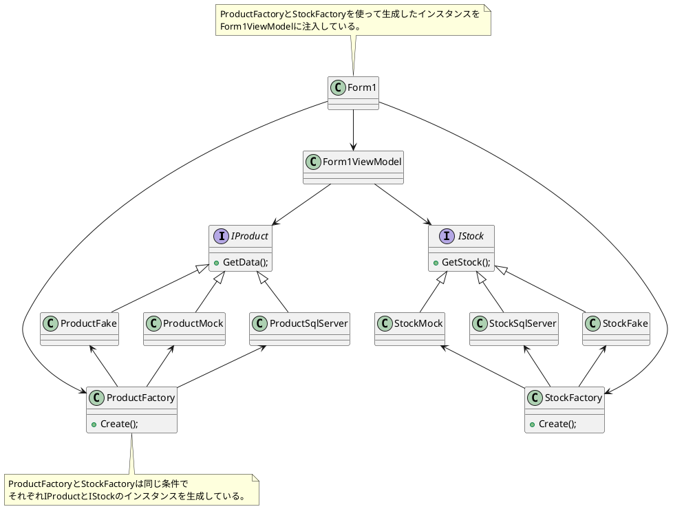
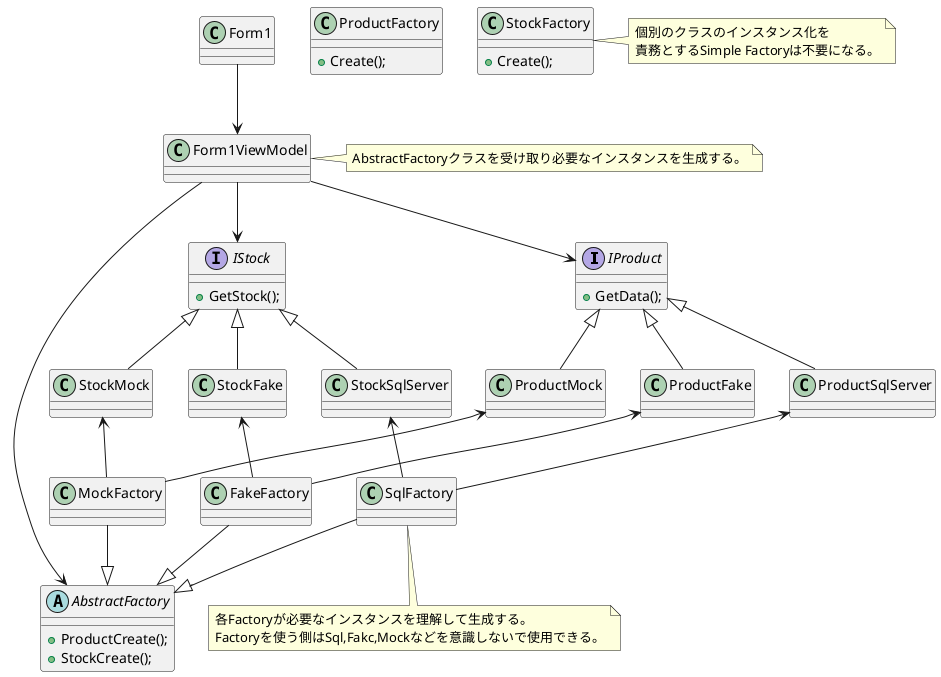
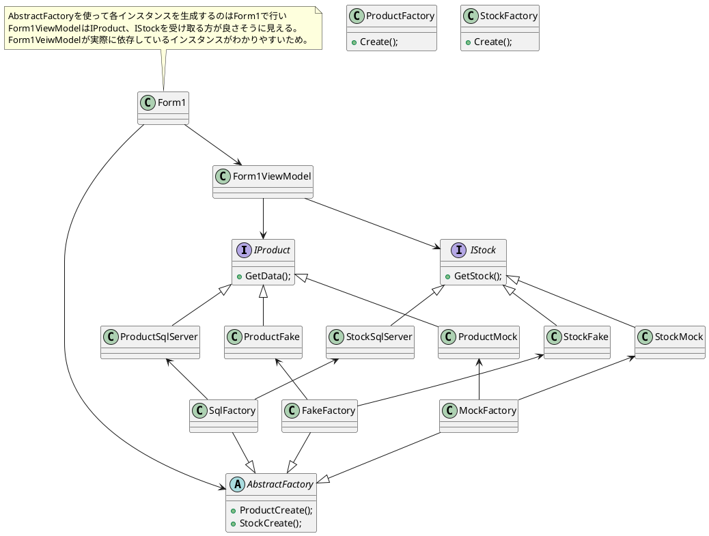
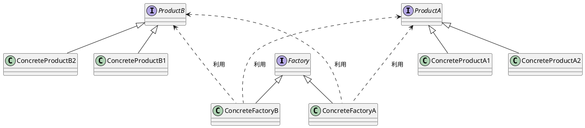

# Abstract Factory パターン

## 概要
- `Simple Factoryパターン` を管理するためのパターン
- `Factoryクラス` を差し替え可能にするパターン
    - `Simple Factoryパターン` はコンストラクタのカプセル化が目的だった。
- `Factoryクラス` を組み合わせて一つのシステムで生成するものを切り替えたい場合に有効
    - `Simple Factoryパターン` だけでは生成するインスタンスの判定ロジックが重複する場合に有効。
 

## C#のデザインパターン
### Simple Factoryのパターン

### Abstract Factoryのパターン

### Abstract Factoryのパターン：個人的思い

## Clean Archtecture
### 実装方法(AbstractFactory)
複数のクラスを組み合わせることで複雑なインスタンスを生成するパターン
- Clean Architecture 11章 DIP:依存関係逆転の原則 P.105
  - 目的：ビジネスロジック層と具象クラス層の間にインターフェースを用意することで変更の影響範囲を抑える。Factoryクラスも具象クラスなので、影響の範囲外にする必要がある。
  - 抽象クラスに依存するために具象クラスの生成をFactoryクラスに任せる
  - Factoryクラスも具象クラスなのでAbstractFactoryのインターフェースをビジネスロジックはサポートする
  - main関数など全体の制御するクラスが具象クラスのFactoryクラスの生成を行う。
  

