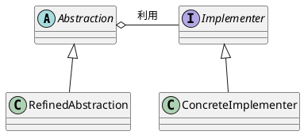

# Bridge

# Bridgeパターン
## 使い所

## 実装方法

```plantuml
@startuml
Abstraction o- Implementer : 利用
Abstraction <|-- RefinedAbstraction
Implementer <|-- ConcreteImplementer

interface Implementer{}
abstract Abstraction{}
@enduml
```

