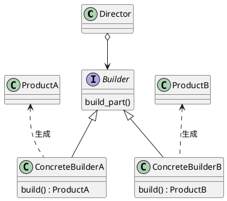

# Builder

## 使い所

- オブジェクトをさまざまな側面から複数の方法で構成することが可能であ流場合に有効
    - オブジェクトの生成のコードをシンプルにできる
    - コードの意図が明確になる
- 生成のコードを `実装` ではなく `意図` に抽象化することができる
    - 生成する `Product` の設定に関するメソッドを作成して自分自身を戻り値にする
    - 自分自身に対して再度メソッドを指定するように記載することで数珠繋ぎでパラメータを設定してどのような `Product` を生成したいのかを理解しやすくする

## 実装方法



- Adaptive Code 5章

    ```plantuml
    @startuml
    interface IBuilder {
        + BuildPart()
    }
    class ConcreteBuilder {
        +BuildPart()
        Create(): Product
    }

    IBuilder <|- ConcreteBuilder
    ConcreteBuilder --> Product: create

    @enduml
    ```

    ```csharp
    // Builderの実装
    public class accountServiceBuilder
    {
        private readonly AccountService _accountService;
        private readonly Mock<IAccountRepository> _mockAccountRepo;

        public Mock<Account> MockAccount
        {
            get;
            private set;
        }

        public AccountServiceBuilder()
        {
            _mockAccountRepo = new Mock<IAccountRepository>();
            _accountService = new AccountService(_mockAccountRepo.Object);
        }

        public AccountServiceBuilder WithAccountCalled(string accountName)
        {
            MockAccount = new Mock<Account>();
            _mockAccountRepo.Setup(r => r.GetByName("Trading Account"))
                            .Returns(MockAccount.Object);

            return this;
        }

        public AccountServiceBuilder AddTransactionOfValue(decimal transactionValue)
        {
            MockAccount.Setup(a => a.AddTransaction(200m).Verifiable();)
            return this;
        }

        public AccountService Build()
        {
            return _accountService;
        }
    }

    // 使用箇所
    public void AddingTransactionToAccountDelegatesToAccountInstance()
    {
        // 数珠繋ぎでのパラメータ設定例
        var sut = _accountServiceBuilder
            .WithAccountCalled("Trading Account")
            .AddTransactionOfValue(200m)
            .Build();

        sut.AddTransactionToAccount("Trading Account", 200m);

        // MockAccountは Mock<Account>型のインスタンス
        _accountServiceBuilder.MockAccount.Verify();
    }

    ```

## Factoryパターンとの違い

- Builderパターンにはオブジェクトの生成をカスタマイズするメソッドが含まれている
