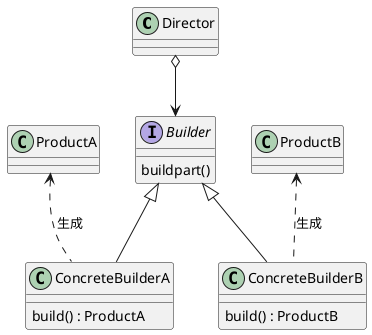

# Builder

# Builder

## 使い所

## 実装方法

```plantuml
@startuml
Director o--> Builder
Builder <|-- ConcreteBuilderA
Builder <|-- ConcreteBuilderB
ProductA <.. ConcreteBuilderA : 生成
ProductB <.. ConcreteBuilderB : 生成

interface Builder{
    buildpart()
}
class ConcreteBuilderA{
    build() : ProductA
}

class ConcreteBuilderB{
    build() : ProductB
}


@enduml
```

