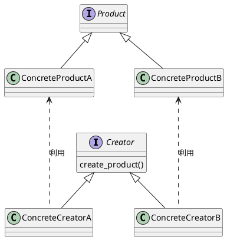
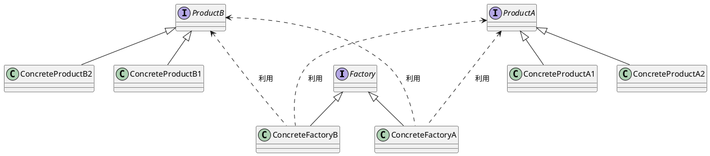

# Factory Meshod

# Factory Method

## 使い所

## 実装方法(Factory Method)
各クラスをシンプルに生成するパターン

## 実装方法(AbstractFactory)
複数のクラスを組み合わせることで複雑なインスタンスを生成するパターン
- Clean Architecture 11章 DIP:依存関係逆転の原則 P.105
  - 目的：ビジネスロジック層と具象クラス層の間にインターフェースを用意することで変更の影響範囲を抑える。Factoryクラスも具象クラスなので、影響の範囲外にする必要がある。
  - 抽象クラスに依存するために具象クラスの生成をFactoryクラスに任せる
  - Factoryクラスも具象クラスなのでAbstractFactoryのインターフェースをビジネスロジックはサポートする
  - main関数など全体の制御するクラスが具象クラスのFactoryクラスの生成を行う。
  

