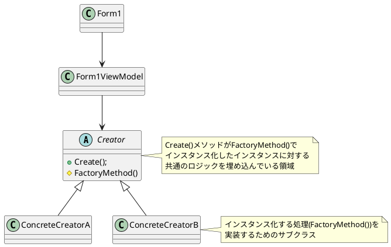
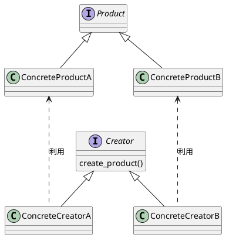

# Factory Meshod
## 概要
- 継承を使って、共通のロジックと生成ロジックを分ける。
    - 共通のロジックは親クラスが持つ
    - 生成のロジックはサブクラスが持つ
    - `Template Methodパターン` を応用している。
- 基本的には `Simple Factoryパターン` でFactoryパターンを実装する。
    - `Abstract Factoryパターン` はグループ化したい場合に実装する。
    - `Factory Methodパターン` はインスタンスに対して共通化したい処理がある場合に実装する。
        - 継承を使うためコードの複雑性が増す傾向にある。
        - 共通のロジックは別途 `Staticメソッド` 化するなど `Factory Methodパターン` でなくても実装する方法はある。

## C#
### Factory Methodパターン

## Python
### 実装方法(Factory Method)
各クラスをシンプルに生成するパターン

