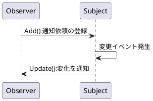
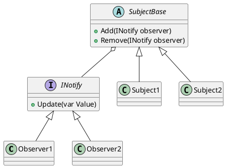
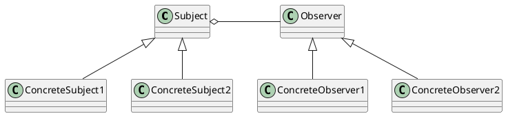

# Observerパターン
変更があった場合に関連するクラスに通知を行うパターン。  
単語の意味：監視者、観測者

## 使い所
- Subject（Publish）が変化したタイミングで、Observer（SubScribe）側が処理を行いたい場合。
- ポーリング処理を行いたくない場合。
    - 各オブジェクトの同期ができなくなる
    - ポーリングによる処理負荷が増える

## 実装方法
- delegateを使う：C#固有の機能を使う。
- インターフェースを使う：インターフェースを定義することでアクセス、登録手順を作る。
    - 【Observer】INotify Update()：通知してもらうためのメソッド
    - 【Subject】SubjectBase Add()：通知対象の登録用のメソッド
    - 【Subject】SubjectBase Remove()：通知対象の解除用のメソッド

基本的な処理の流れは

## ポイント
- Observer、Sbujectをそれぞれインターフェース、抽象クラス化することで通知イベントを切り替えられるようにすることで、テスト容易性が上がる。
- Push型：Updateメソッドの引数で変化した値を渡す。delegateを使う場合はPush型になる。よく使う方法。
- Pull型：Updateメソッドに引数が無い。通知後に値が必要な場合は本体のプロパティにアクセスする。  
引数がないので、汎用性が高いが、プロパティの公開やアクセス処理が必要になる。

## 参考図書
- [Head First デザインパターン](https://www.amazon.co.jp/Head-Firstデザインパターン-―頭とからだで覚えるデザインパターンの基本-Eric-Freeman/dp/4873112494/ref=sr_1_1?__mk_ja_JP=カタカナ&crid=30CRHBJ4W941Q&keywords=head+first+デザイン&qid=1671757160&sprefix=head+first+デザイン%2Caps%2C169&sr=8-1)

- [Game Programming Patterns](https://www.amazon.co.jp/gp/product/B015R0M8W0/ref=ppx_yo_dt_b_d_asin_title_o07?ie=UTF8&psc=1)

