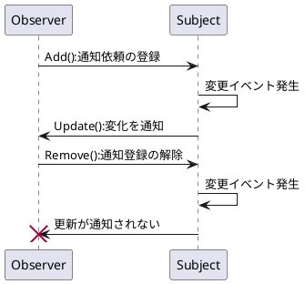
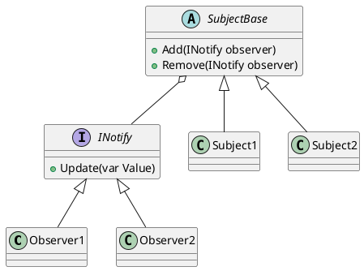
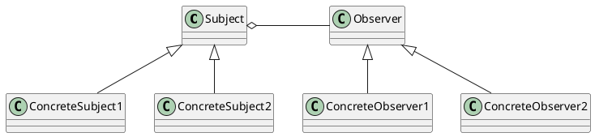
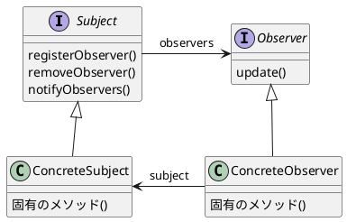
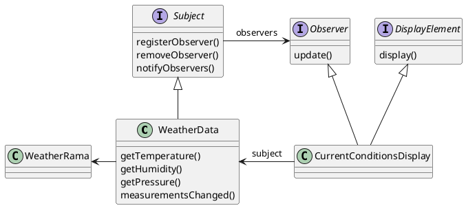
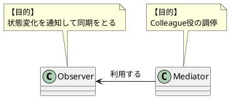

# Observerパターン
変更があった場合に関連するクラスに通知を行うパターン。  
単語の意味：監視者、観測者

## 定義
```
Observerパターンは、オブジェクト間の1対多の依存関係を定義し、あるオブジェクトの状態が変化すると、
それに依存しているすべてのオブジェクトが自動的に通知され更新されるようにします。
```

## 使い所
- Subject（Publish）が変化したタイミングで、Observer（SubScribe）側が処理を行いたい場合。
- ポーリング処理を行いたくない場合。
    - 各オブジェクトの同期ができなくなる
    - ポーリングによる処理負荷が増える
- 1つのデータ(**依存されるデータ**)に複数のオブジェクトが依存する場合に、**依存されるデータ**をSubjectクラスでカプセル化することで、データの更新処理を1つのクラスにまとめることができる。
    - **依存されるデータ**に依存するのではなく、Subject Interfaceに依存する用になるのでより、疎結合になる。


## 実装方法
- delegateを使う：C#固有の機能を使う。
- インターフェースを使う：インターフェースを定義することでアクセス、登録手順を作る。
    - 【Observer】INotify Update()：通知してもらうためのメソッド
    - 【Subject】SubjectBase Add()：通知対象の登録用のメソッド
    - 【Subject】SubjectBase Remove()：通知対象の解除用のメソッド

- 基本的な処理の流れ

- クラス図1


- クラス図2


- クラス図:Head-First


## ポイント
- Observer、Sbujectをそれぞれインターフェース、抽象クラス化することで通知イベントを切り替えられるようにすることで、テスト容易性が上がる。
- Push型：Updateメソッドの引数で変化した値を渡す。delegateを使う場合はPush型になる。よく使う方法。
- Pull型：Updateメソッドに引数が無い。通知後に値が必要な場合は本体のプロパティにアクセスする。  
引数がないので、汎用性が高いが、プロパティの公開やアクセス処理が必要になる。

## Head-First




### 気づき
- `Subject`をインターフェースとして実装しているが、`Observer` は通知と同時に `Subject` の内部状態(メンバ変数)を確認する必要がある。
    - そのため、`Observer` は`Subject`のサブクラスに依存するので、`Subject`を引数にして通知する処理は``リスコフの置換原則`に違反する。
        - Java APIの例(今回はPython実装なので試していない)
    - デザインパターン入門では`Subject`は具象クラスにしているので、その方がシンプルで良い気がする。
        - `Subject`のインターフェースはあくまで、3つのメソッドの実装を強制するための手段である。


## デザインパターン入門
### 関連パターン
- 一覧

|name|分類|概要|
|---|---|---|
|Mediator|利用される|MediatorはObserverの機能拡張版。|

- 図

## 参考図書

- [Head First デザインパターン](https://www.amazon.co.jp/Head-Firstデザインパターン-―頭とからだで覚えるデザインパターンの基本-Eric-Freeman/dp/4873112494/ref=sr_1_1?__mk_ja_JP=カタカナ&crid=30CRHBJ4W941Q&keywords=head+first+デザイン&qid=1671757160&sprefix=head+first+デザイン%2Caps%2C169&sr=8-1)

- [Game Programming Patterns](https://www.amazon.co.jp/gp/product/B015R0M8W0/ref=ppx_yo_dt_b_d_asin_title_o07?ie=UTF8&psc=1)

- [デザインパターン入門](https://www.amazon.co.jp/増補改訂版-Java言語で学ぶデザインパターン入門-結城-浩-ebook/dp/B00I8ATHGW/ref=sr_1_2?__mk_ja_JP=カタカナ&crid=1WCY1UVVL5POM&keywords=デザインパターン入門&qid=1671802445&sprefix=デザインパターン入門%2Caps%2C179&sr=8-2)
