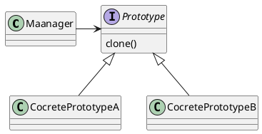
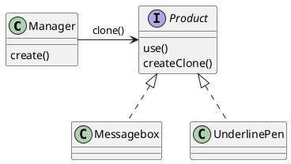
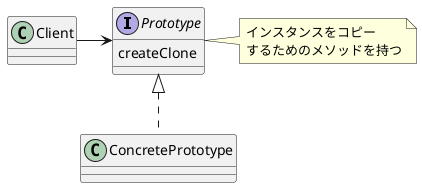
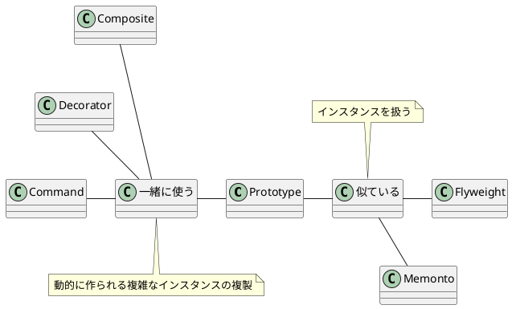

# Prototype
- インスタンスからインスタンスを生成するパターン
    - Factoryパターンなどはクラスからインスタンスを生成するパターン

## 使い所
- インスタンスから複製して新しいインスタンスを作りたい場合
    1. 種類が多すぎてすべてをクラスとして表現できない場合
    2. クラスからのインスタンス生成が難しい場合
        - GUIでユーザーが作成した図形など多くのプロパティを持つインスタンスの複製はクラスから作るのが難しい。
    3. フレームワークと生成するインスタンスを分けたい場合
        - インスタンス生成のフレームワークを使ってインスタンスを生成する場合の特定のクラスに依存したフレームワークにしないようにするため
        - クラス名ではない文字列などでインスタンス生成ができるようになる。

## 実装方法

## デザインパターン入門
- デザインパターン入門:例のクラス図

- デザインパターン入門：一般化

### 気づき
- クラス名による束縛
    - 再利用できるようにするためにはクラス名を使用しない方が良い場合がある。
    - 文字列など動的に切り替えできる名前を使うことで再利用時にクラスを含めずに再利用ができる。

### 関連メソッド
- 一覧  

|name|関係|概要|
|----|----|----|
|Flyweight|似ている|Flyweightでは1つのインスタンスを複数の場所で共有している。|
|Memento|似ている|Mementoではスナップショットのために現在のインスタンスを保存する。|
|Composite|一緒に使う|動的に作られるインスタンスを複製するために使う。|
|Decorator|一緒に使う|動的に作られるインスタンスを複製するために使う。|
|Commnad|一緒に使う|Commandを複製するために使う。|

- 関係図

## 参考
- [Java言語で学ぶ デザインパターン入門](https://www.amazon.co.jp/増補改訂版-Java言語で学ぶデザインパターン入門-結城-浩-ebook/dp/B00I8ATHGW/ref=sr_1_2?keywords=デザインパターン入門&qid=1672116561&sprefix=%2Caps%2C167&sr=8-2)

