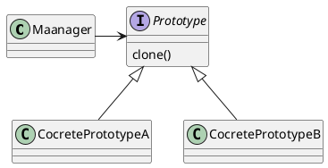

# Prototype

# Pototypeパターン
## 使い所

## 実装方法

```plantuml
@startuml

Maanager -> Prototype
Prototype <|-- CocretePrototypeA
Prototype <|-- CocretePrototypeB


interface Prototype{
clone()
}


@enduml
```

