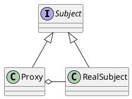

# Proxy

# Proxyパターン
## 使い方
既存のAPIに対して機能の追加を行いたい場合に`RealSubject`と同じ`Interface`と同じ`Ploxy`で処理を行う。  
実処理は`RealSubject`が実行する。

## 実装方法

```plantuml
@startuml
Subject <|-- Proxy
Subject <|-- RealSubject
Proxy o- RealSubject

interface Subject {}
@enduml
```